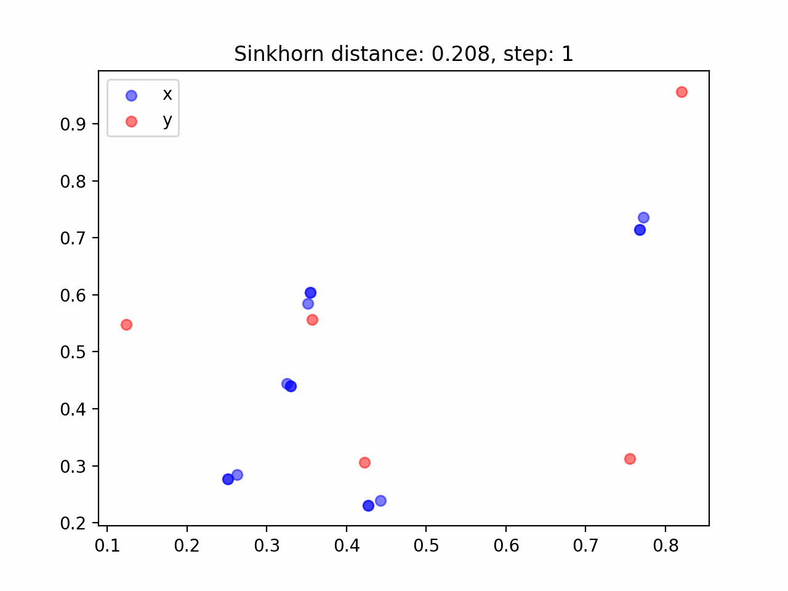

# optimal-transport
Just for Learning optimal transport in Jax

# How to use
```
rye run python3 sinkhorn.py
```

# example
- sinkhorn.py


- gradientflow.py



# Ref.
- 最適輸送の理論とアルゴリズム, 佐藤竜馬
- 「なんでも微分する」, 佐藤竜馬, https://speakerdeck.com/joisino/he-demowei-fen-suru